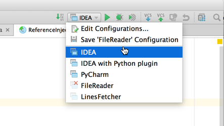

## Installing Git

The source code of IntelliJ IDEA Community Edition is stored in a Git repository. Therefore, in order to check out the sources, you need to have Git installed. We recommend using the [msys git](https://msysgit.github.io) distribution on Windows and [git-osx-installer](http://code.google.com/p/git-osx-installer/) on Mac.

## Checking Out the Code

You can check out the code either by using IntelliJ IDEA or from the command line.

**Checking out from IntelliJ IDEA:**
 
* Select **VCS \| Checkout from Version Control \| Git** from the main menu
* In the **Git Repository URL** field, enter `git://git.jetbrains.org/idea/community.git`


**Checking out from the command line:**

Please execute the following command:

```
git clone --depth 1 git://git.jetbrains.org/idea/community.git idea
```

The [master](https://github.com/JetBrains/intellij-community/tree/master) branch currently contains the code for the most recent development version of IntelliJ IDEA. Source code of older releases of IntelliJ IDEA can be found in the following branches (see [Build Number Ranges](/basics/getting_started/build_number_ranges.md) for more details on branch and build numbers):

| IntelliJ Product version | Branch name/number                                                |
|--------------------------|-------------------------------------------------------------------|
| 2016.2                   | [162](https://github.com/JetBrains/intellij-community/tree/162)   |
| 2016.1                   | [145](https://github.com/JetBrains/intellij-community/tree/145)   |
| 15.0.x                   | [143](https://github.com/JetBrains/intellij-community/tree/143)   |
| 14.1.x                   | [141](https://github.com/JetBrains/intellij-community/tree/141)   |
| 14.0.x                   | [139](https://github.com/JetBrains/intellij-community/tree/139)   |
| 13.1.x                   | [135](https://github.com/JetBrains/intellij-community/tree/135)   |
| 13.0.x                   | [133](https://github.com/JetBrains/intellij-community/tree/133)   |
| 12.0.x                   | [123](https://github.com/JetBrains/intellij-community/tree/123)   |
| 11.1.x                   | [117](https://github.com/JetBrains/intellij-community/tree/117)   |
| 11.0.x                   | [nika](https://github.com/JetBrains/intellij-community/tree/nika) |
| 10.5.x                   | [xena](https://github.com/JetBrains/intellij-community/tree/xena) |
| 10.0.x                   | [x0x](https://github.com/JetBrains/intellij-community/tree/x0x)   |
| 9.x                      | [maia](https://github.com/JetBrains/intellij-community/tree/maia) |


The source code of stable releases of IntelliJ IDEA Community Edition is also available as a tarball:

- [IntelliJ IDEA Community Edition 2016.1.3](https://download.jetbrains.com/idea/ideaIC-2016.1.3-src.tar.bz2)
- [IntelliJ IDEA Community Edition 15.0.6](https://download.jetbrains.com/idea/ideaIC-15.0.6-src.tar.bz2)
- [IntelliJ IDEA Community Edition 14.1.4](https://download.jetbrains.com/idea/ideaIC-14.1.4-src.tar.bz2)
- [IntelliJ IDEA Community Edition 13.1.6](https://download.jetbrains.com/idea/ideaIC-13.1.6-src.tar.bz2)
- [IntelliJ IDEA Community Edition 13.0.4](https://download.jetbrains.com/idea/ideaIC-13.0.4-src.tar.bz2)
- [IntelliJ IDEA Community Edition 12.1.6](https://download.jetbrains.com/idea/ideaIC-12.1.6-src.tar.bz2)
- [IntelliJ IDEA Community Edition 12.0.4](https://download.jetbrains.com/idea/ideaIC-12.0.4-src.tar.bz2)
- [IntelliJ IDEA Community Edition 11.1.4](https://download.jetbrains.com/idea/ideaIC-11.1.4-src.tar.bz2)
- [IntelliJ IDEA Community Edition 11.0.2](https://download.jetbrains.com/idea/ideaIC-11.0.2-src.tar.bz2)
- [IntelliJ IDEA Community Edition 10.5.4](https://download.jetbrains.com/idea/ideaIC-10.5.4-src.tar.bz2)
- [IntelliJ IDEA Community Edition 10.0.3](https://download.jetbrains.com/idea/ideaIC-10.0.3-src.tar.bz2)
- [IntelliJ IDEA Community Edition 9.0.4](https://download.jetbrains.com/idea/ideaIC-9.0.4-src.tar.bz2)

## Forking on GitHub

As an alternative to checking out the official repository, you can fork the GitHub mirror of the IntelliJ Platform source code, make changes in your own fork, and send us a pull request.

The GitHub mirror can be found at [https://github.com/JetBrains/intellij-community](https://github.com/JetBrains/intellij-community).

## Building and Running from the IDE

To develop plugins and applications on the IntelliJ Platform, you can use either [IntelliJ IDEA Community Edition](https://www.jetbrains.com/idea/download/) or [IntelliJ IDEA Ultimate](https://www.jetbrains.com/idea/download/). Note that this requires 15.0 or later.

**Building and running the code**

* Run `getPlugins.sh`/`getPlugins.bat` from the project root directory to check out additional modules.
* If this git repository is not on `master` branch you need to checkout the same branches/tags in `android` and `android/tools-base` git repositories.
* Open the project.
* If an error notification about a missing required plugin (e.g. Kotlin) is shown enable or install that plugin.
* Configure a JSDK named "IDEA jdk" (case sensitive), pointing to an installation of JDK 1.6.

   

* Unless you're running on a Mac with an Apple JDK, add `/lib/tools.jar` to the set of "IDEA jdk" jars.

   

* Configure a JSDK named "1.8", pointing to an installation of JDK 1.8.
* Add `/lib/tools.jar` to the set of "1.8" jars.
* Use **Build \| Make Project** to build the code.
* To run the code, use the provided shared run configuration "IDEA".

   

## Building and Running from the Command Line

To build the distribution archive of *IntelliJ IDEA Community Edition*, execute the [build.xml](upsource:///build.xml) Ant build script in the root directory of the source code.


The results of the build execution can be found at *out/artifacts*.
