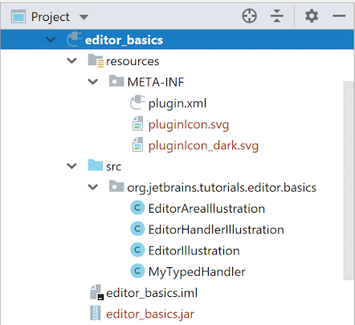

Before your custom plugin can be used, it must be deployed: built, installed, and then enabled using Plugin Manager.

To deploy a plugin:

* Make your project by invoking **Build \| Make Project**.

* Prepare your plugin for deployment.
  In the main menu, select **Build \| Prepare Plugin Module `<module name>` for Deployment**.

  

* If the plugin module does not depend on any libraries, a .jar archive will be created.
  Otherwise, a .zip archive will be created including all the plugin libraries specified in the project settings.

  

* Copy the newly created archive file to the *.IntelliJIDEAx0\config\plugins* folder, and then restart IntelliJ IDEA so the changes take effect.
  To know how to locate your *plugins* directory, refer to [IDE Settings, Caches, Logs, and Plugins](/basics/settings_caches_logs.md).

  

* In the main menu, select **File \| Settings** to open the Settings dialog box.

* In the Settings dialog box, under **IDE Settings**, click **Plugins**.

* In the Plugins area, open the **Installed** tab, and then select the check-box next to your plugin name.

* When finished, click OK to close the Settings dialog box.

* Restart *IntelliJ IDEA* so that your changes take effect.
