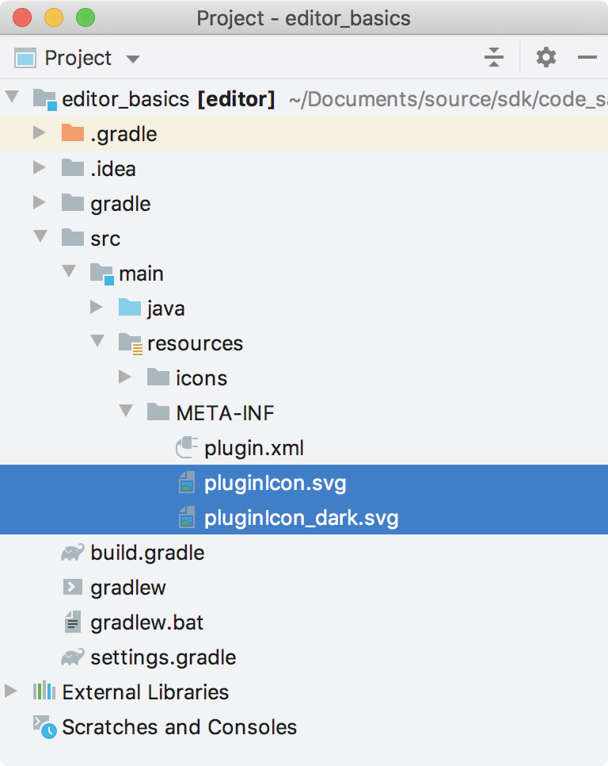

Beginning in version 2018.3, the IntelliJ Platform supports representing a plugin with an icon.
A _Plugin Icon_ is intended to be a unique representation of a plugin's functionality, technology, or 
company. 

Plugin Icons are shown in the Settings/Preferences [Plugin Manager](https://www.jetbrains.com/help/idea/managing-plugins.html) UI
in JetBrains' products. Plugin Icons also appear in the [Plugins Repository](https://plugins.jetbrains.com/),
and also in [MarketPlace](https://plugins.jetbrains.com/marketplace).

**Note:** icons and images that are used within a plugin have different requirements. 
See [Working with Icons and Images](/reference_guide/work_with_icons_and_images.md)
for more information.

### Plugin Icon File Format
All Plugin Icon images must be provided in SVG format. 
Plugin Icons will be displayed in 40px by 40px and 80px by 80px size. However, _only one
size icon_ should be supplied because it will automatically
scale.

| Icon Size  | Example SVG Icon                            |
| ------------- | -------------                            |
| 40x40         |   |

### Plugin Icon File Naming Convention
Plugin Icon files are named according to the following conventions:
* `pluginIcon.svg` for use with the default (light) JetBrains IDE theme
* `pluginIcon_dark.svg` for use with the Darcula JetBrains IDE theme

### Adding Plugin Icons to a Plugin Project
The Plugin Icon files must be in the `META-INF` folder of the plugin distribution file, 
i.e. the `*.jar` or `*.zip` file you upload to the plugin repository and install into
a JetBrains IDE.

To include Plugin Icons in your distribution file, place the Plugin Icon files 
into a plugin project's `resources/META-INF` folder. Note this requirement
is the same regardless of using DevKit or Gradle for developing a plugin. For example:
 

