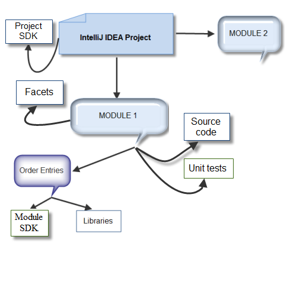

<!--TODO split into parts accordingly to the table of contents-->

This topic considers the concept of projects based on *IntelliJ Platform* and related subjects, such as _modules_, _facets_, _libraries_, _SDK_. The project structure and Java classes you can use to manage projects and modules have been considered.

## Project and its components

This section briefly discusses the IDEA project structure, project components and related terms.  For more information about projects and their components, refer to [Project](https://www.jetbrains.com/help/idea/about-projects.html), [Module](https://www.jetbrains.com/help/idea/configuring-projects.html#working-with-modules), [Library](https://www.jetbrains.com/help/idea/working-with-libraries.html), [Facet](https://www.jetbrains.com/help/idea/adding-support-for-frameworks-and-technologies.html#facets) in the *IntelliJ IDEA* Web Help.

### Project

In the *IntelliJ Platform*, a _project_ encapsulates all your source code, libraries, and build instructions into a single organizational unit.  Everything you do using the *IntelliJ Platform SDK* is done within the context of a project. A project defines collections referred to as _modules_ and _libraries_.  Depending on the logical and functional requirements to the project, you can create a _single-module_ or a _multi-module_ project.

### Module

A _module_ is a discrete unit of functionality that can be run, tested, and debugged independently. Modules includes such things as source code, build scripts, unit tests, deployment descriptors, etc. In the project, each module can use a specific SDK or inherit SDK defined on the project level (see the [SDK](/reference_guide/project_model/sdk.md) section later in this document). A module can depend on other modules of the project.

### Library

A _library_ is an archive of compiled code (such as JAR files) that your modules depend on. The *IntelliJ Platform* supports three types of libraries:

* **Module Library**: the library classes are visible only in this module and the library information is recorded in the module `.iml` file.
* **Project Library**: the library classes are visible within the project and the library information is recorded in the project `.ipr` file or in `.idea/libraries`.
* **Global Library**: the library information is recorded in the `applicationLibraries.xml` file into the `~/.IntelliJIdea/config/options` directory. Global libraries are similar to project libraries, but are visible for the different projects.

For more information about libraries, refer to [Library](https://www.jetbrains.com/help/idea/working-with-libraries.html).

### SDK

Every project uses a Software Development Kit (_SDK_). For Java projects, SDK is referred to as JDK (Java Development Kit).

The SDK determines which API library is used to build the project. If your project is multi-module, the project SDK by default is common for all modules within the project. 

Optionally, you can configure individual SDK for each module.

For more information about SDKs, see [Working with SDKs](https://www.jetbrains.com/help/idea/working-with-sdks.html) in the *IntelliJ IDEA* Web Help.

### Facet

A _facet_ represents certain configuration, specific for a particular framework/technology, associated with a module. A module can have multiple facets. E.g. Spring specific configuration is stored in a Spring facet.

For more information about facets see [Facet](https://www.jetbrains.com/help/idea/adding-support-for-frameworks-and-technologies.html#facets) and [Language and Framework Specific Guidelines](https://www.jetbrains.com/help/idea/language-and-framework-specific-guidelines.html) in the *IntelliJ IDEA* Web Help.

## Project Structure

From the plugin developer's point of view, a project can be thought of as follows:

A **project** consists of one or several **modules**. Each **module** includes the plugin source code and so called **order entries** that refer to **SDK** and **libraries** the module uses. By default, all modules uses the project SDK. In addition, a **module** can optionally have a set of **facets**.

For more information on each of these entities, see:

- [Project](/reference_guide/project_model/project.md)
- [Module](/reference_guide/project_model/module.md)
- [SDK](/reference_guide/project_model/sdk.md)
- [Library](/reference_guide/project_model/facet.md)
- [External system integration](/reference_guide/frameworks_and_external_apis/external_system_integration.md) (for projects imported from Gradle or similar build systems)
