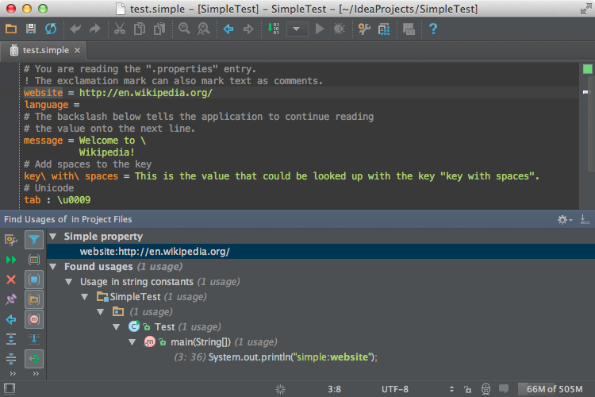

A find usage provider uses a word scanner to build an index of words present in every file.
A scanner breaks the text into words, defines the context for each word and passes it to the find usage provider.

### 1. Define a find usages provider

```java
package com.simpleplugin;

import com.intellij.lang.cacheBuilder.DefaultWordsScanner;
import com.intellij.lang.cacheBuilder.WordsScanner;
import com.intellij.lang.findUsages.FindUsagesProvider;
import com.intellij.lexer.FlexAdapter;
import com.intellij.psi.PsiElement;
import com.intellij.psi.PsiNamedElement;
import com.intellij.psi.tree.TokenSet;
import com.simpleplugin.psi.SimpleProperty;
import com.simpleplugin.psi.SimpleTypes;
import org.jetbrains.annotations.NotNull;
import org.jetbrains.annotations.Nullable;

import java.io.Reader;

public class SimpleFindUsagesProvider implements FindUsagesProvider {
    private static final DefaultWordsScanner WORDS_SCANNER =
            new DefaultWordsScanner(new FlexAdapter(new SimpleLexer((Reader) null)),
                    TokenSet.create(SimpleTypes.KEY), TokenSet.create(SimpleTypes.COMMENT), TokenSet.EMPTY);

    @Nullable
    @Override
    public WordsScanner getWordsScanner() {
        return WORDS_SCANNER;
    }

    @Override
    public boolean canFindUsagesFor(@NotNull PsiElement psiElement) {
        return psiElement instanceof PsiNamedElement;
    }

    @Nullable
    @Override
    public String getHelpId(@NotNull PsiElement psiElement) {
        return null;
    }

    @NotNull
    @Override
    public String getType(@NotNull PsiElement element) {
        if (element instanceof SimpleProperty) {
            return "simple property";
        } else {
            return "";
        }
    }

    @NotNull
    @Override
    public String getDescriptiveName(@NotNull PsiElement element) {
        if (element instanceof SimpleProperty) {
            return ((SimpleProperty) element).getKey();
        } else {
            return "";
        }
    }

    @NotNull
    @Override
    public String getNodeText(@NotNull PsiElement element, boolean useFullName) {
        if (element instanceof SimpleProperty) {
            return ((SimpleProperty) element).getKey() + ":" + ((SimpleProperty) element).getValue();
        } else {
            return "";
        }
    }
}
```

### 2. Register the find usages provider

```xml
<lang.findUsagesProvider language="Simple" implementationClass="com.simpleplugin.SimpleFindUsagesProvider"/>
```

### 3. Run the project

Now we can call *Find Usages* for any property with a reference.



[Previous](reference_contributor.html)
[Top](custom_language_support.html)
[Next](folding_builder.html)
