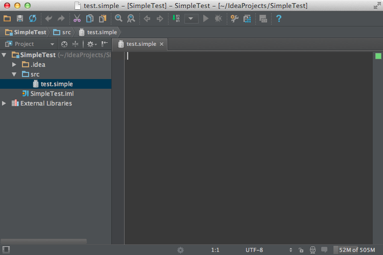

<!--
INITIAL_SOURCE https://confluence.jetbrains.com/display/IntelliJIDEA/Language+and+File+Type
-->


### 1. Define a language

```java
package com.simpleplugin;

import com.intellij.lang.Language;

public class SimpleLanguage extends Language {
    public static final SimpleLanguage INSTANCE = new SimpleLanguage();

    private SimpleLanguage() {
        super("Simple");
    }
}
```

### 2. Define an icon

Copy the
[icon](https://raw.github.com/cheptsov/SimplePlugin/master/src/com/simpleplugin/icons/jar-gray.png)
to **com.simpleplugin.icons** package.

```java
package com.simpleplugin;

import com.intellij.openapi.util.IconLoader;

import javax.swing.*;

public class SimpleIcons {
    public static final Icon FILE = IconLoader.getIcon("/com/simpleplugin/icons/jar-gray.png");
}
```

### 3. Define a file type

```java
package com.simpleplugin;

import com.intellij.openapi.fileTypes.LanguageFileType;
import org.jetbrains.annotations.NotNull;
import org.jetbrains.annotations.Nullable;

import javax.swing.*;

public class SimpleFileType extends LanguageFileType {
    public static final SimpleFileType INSTANCE = new SimpleFileType();

    private SimpleFileType() {
        super(SimpleLanguage.INSTANCE);
    }

    @NotNull
    @Override
    public String getName() {
        return "Simple file";
    }

    @NotNull
    @Override
    public String getDescription() {
        return "Simple language file";
    }

    @NotNull
    @Override
    public String getDefaultExtension() {
        return "simple";
    }

    @Nullable
    @Override
    public Icon getIcon() {
        return SimpleIcons.FILE;
    }
}
```

### 4. Define a file type factory

```java
package com.simpleplugin;

import com.intellij.openapi.fileTypes.FileTypeConsumer;
import com.intellij.openapi.fileTypes.FileTypeFactory;
import org.jetbrains.annotations.NotNull;

public class SimpleFileTypeFactory extends FileTypeFactory{
    @Override
    public void createFileTypes(@NotNull FileTypeConsumer fileTypeConsumer) {
        fileTypeConsumer.consume(SimpleFileType.INSTANCE, "simple");
    }
}
```

### 5. Register the file type factory

```xml
      <fileTypeFactory implementation="com.simpleplugin.SimpleFileTypeFactory"/>
```

### 6. Run the project

Create a file with extension *.simple*
and IntelliJ IDEA will automatically associate it with our language.



[Previous](cls_prerequisites.html)
[Top](cls_tutorial.html)
[Next](TODO)
