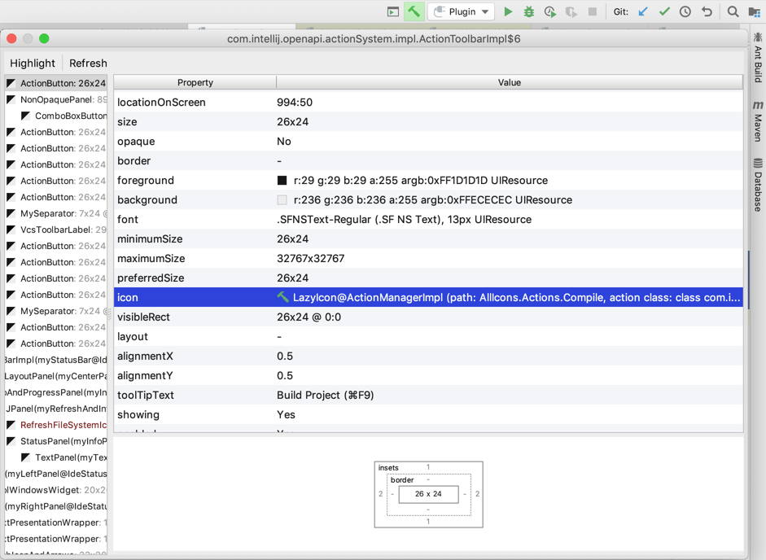

<!-- Copyright 2000-2020 JetBrains s.r.o. and other contributors. Use of this source code is governed by the Apache 2.0 license that can be found in the LICENSE file. -->

The _UI Inspector_ is a tool to interrogate elements of the IntelliJ IDEA UI to get an internal description of each element.
UI elements can be tested interactively by clicking on the element while the _UI Inspector_ is enabled.

If the menu item **Tools \| Internal Actions \| UI \| UI Inspector** is not available in IntelliJ IDEA, then the first step is to [enable internal mode](enabling_internal.md)

## Enabling the UI Inspector
Before using the _UI Inspector_, it must be enabled by selecting the menu item **Tools \| Internal Actions \| UI \| UI Inspector**.
The enabled state of the _UI Inspector_ is modal; it remains enabled until it is disabled by selecting the _UI Inspector_ menu item again. 

## Using the UI Inspector
While enabled, centering the cursor on a UI element and pressing <kbd>Control/Cmd</kbd>+<kbd>Alt</kbd> when _clicking_ the mouse reveals the properties of the Swing component.

> **TIP** If the component relates to an [Action](/basics/action_system.md) (e.g. Action Button or Menu Item), the Action class name and its ID will be shown.

For example, to get information about the _Build Project_ button's icon (hammer) on the toolbar (highlighted in green), put the mouse cursor on the icon and press <kbd>Control/Cmd</kbd>+<kbd>Alt</kbd> while clicking the mouse.

The _UI Inspector_ displays that the icon has the internal path `Allcons.Actions.Compile`:

## Providing Additional Properties
Custom Swing components can provide additional properties to be displayed in the _UI Inspector_ dialog via [`UiInspectorContextProvider`](upsource:///platform/platform-impl/src/com/intellij/internal/inspector/UiInspectorContextProvider.java) (2020.1 and later). 