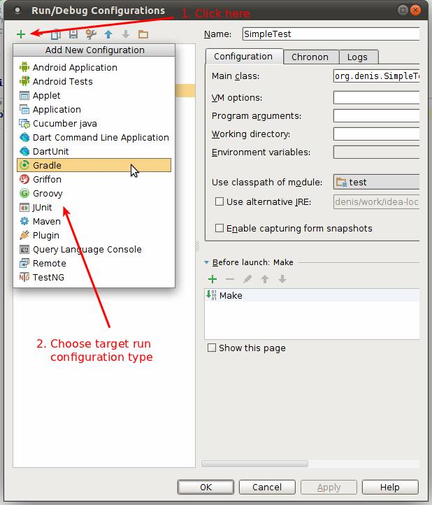
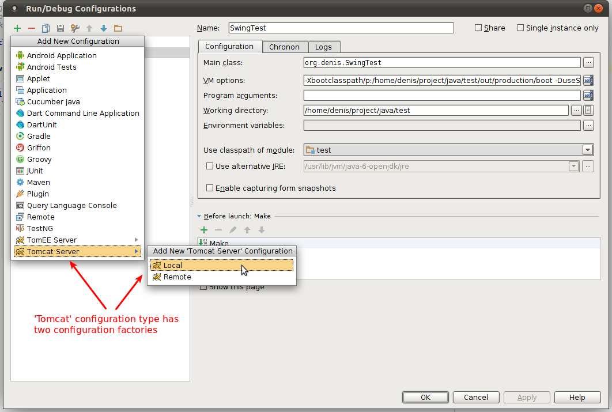
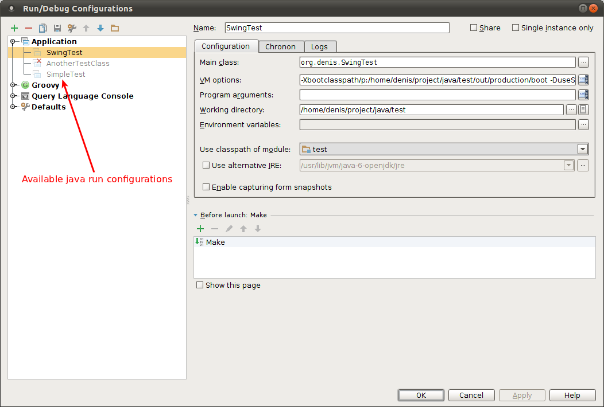

<!--
INITIAL_SOURCE https://confluence.jetbrains.com/display/IDEADEV/Run+Configurations
-->


# Purpose

A run configuration provides the user with the possibility to run a certain type of external process (script, application server etc.) from within the IDE. You can provide UI for the user to specify execution options, as well as the possibility to create run configuration based on a specific location in the source code.

In this document, we'll start with explaining the core concepts used by the run configuration API and then will proceed to look at the sequence of steps required to implement a typical run configuration.

# High-level


We can separate all entities roughly into two parts *  run configuration management (creation; persistence; modification etc) and execution.

# Management

## ConfigurationType

The starting point for implementing any run configuration type is the
[ConfigurationType](https://github.com/JetBrains/intellij-community/blob/master/platform/lang-api/src/com/intellij/execution/configurations/ConfigurationType.java)
interface.
List of available configuration type is shown when a user opens _'Edit run configurations'_ dialog and executes _'Add'_ action:



Every type there is represented as an instance of
[ConfigurationType](https://github.com/JetBrains/intellij-community/blob/master/platform/lang-api/src/com/intellij/execution/configurations/ConfigurationType.java)
and registered like below:

```xml
<configurationType implementation="org.jetbrains.plugins.gradle.service.execution.GradleExternalTaskConfigurationType"/>
```

The easiest way to implement this interface is to use the
[ConfigurationTypeBase](https://github.com/JetBrains/intellij-community/blob/master/platform/lang-api/src/com/intellij/execution/configurations/ConfigurationTypeBase.java) base class. In order to use it, you need to inherit from it and to provide the configuration type parameters (ID, name, description and icon) as constructor parameters. In addition to that, you need to call the
[addFactory()](https://github.com/JetBrains/intellij-community/blob/master/platform/lang-api/src/com/intellij/execution/configurations/ConfigurationTypeBase.java#L46)
method to add a configuration factory.

## ConfigurationFactory

All run configurations are created by
[ConfigurationFactory](https://github.com/JetBrains/intellij-community/blob/master/platform/lang-api/src/com/intellij/execution/configurations/ConfigurationFactory.java)
registered for particular _ConfigurationType_.
It's possible that one _ConfigurationType_
[has more than one](https://github.com/JetBrains/intellij-community/blob/master/platform/lang-api/src/com/intellij/execution/configurations/ConfigurationType.java#L34)
_ConfigurationFactory_:



The key API of
[ConfigurationFactory](https://github.com/JetBrains/intellij-community/blob/master/platform/lang-api/src/com/intellij/execution/configurations/ConfigurationFactory.java),
and the only method that you're required to implement, is the
[createTemplateConfiguration](https://github.com/JetBrains/intellij-community/blob/master/platform/lang-api/src/com/intellij/execution/configurations/ConfigurationFactory.java#L45)
method.
This method is called once per project to create the template run configuration.
All real run configurations (loaded from the workspace or created by the user) are called by cloning the template through the
[createConfiguration](https://github.com/JetBrains/intellij-community/blob/master/platform/lang-api/src/com/intellij/execution/configurations/ConfigurationFactory.java#L39)
method.

You can customize additional aspects of your configuration factory by overriding the
[getIcon](https://github.com/JetBrains/intellij-community/blob/master/platform/lang-api/src/com/intellij/execution/configurations/ConfigurationFactory.java#L59),
[getAddIcon](https://github.com/JetBrains/intellij-community/blob/master/platform/lang-api/src/com/intellij/execution/configurations/ConfigurationFactory.java#L55),
[getName](https://github.com/JetBrains/intellij-community/blob/master/platform/lang-api/src/com/intellij/execution/configurations/ConfigurationFactory.java#L51)
and the default settings methods.
These additional overrides are optional.

## RunConfiguration

Is represented by
[RunConfiguration](https://github.com/JetBrains/intellij-community/blob/master/platform/lang-api/src/com/intellij/execution/configurations/RunConfiguration.java)
interface.
_'Run configuration'_ here is some named profile which can be executed, e.g. application started via _'main()'_ class, test, remote debug to particular machine/port etc.
Here is an example of a Java run configurations defined for a particular project:



When implementing a run configuration, you may want to use one of the common base classes:

*  [RunConfigurationBase](https://github.com/JetBrains/intellij-community/blob/master/platform/lang-api/src/com/intellij/execution/configurations/RunConfigurationBase.java)
is a general-purpose superclass that contains the most basic implementation of a run configuration.

*  [LocatableConfigurationBase](https://github.com/JetBrains/intellij-community/blob/master/platform/lang-api/src/com/intellij/execution/configurations/LocatableConfigurationBase.java)
is a common base class that should be used for configurations that can be created from context by a ```RunConfigurationProducer```.
It supports automatically generating a name for a configuration from its settings and keeping track of whether the name was changed by the user.

*  [ModuleBasedConfiguration](https://github.com/JetBrains/intellij-community/blob/master/platform/lang-api/src/com/intellij/execution/configurations/ModuleBasedConfiguration.java)
is a base class for a configuration that is associated with a specific module (for example, Java run configurations use the selected module to determine the run classpath).

## SettingsEditor

That common run configuration settings might be modified via:

*  [_RunConfiguration_-specific UI](https://github.com/JetBrains/intellij-community/blob/master/platform/lang-api/src/com/intellij/execution/configurations/RunConfiguration.java#L48).
That is handled by [SettingsEditor](https://github.com/JetBrains/intellij-community/blob/master/platform/platform-api/src/com/intellij/openapi/options/SettingsEditor.java#L97):
*  [_getComponent()_](https://github.com/JetBrains/intellij-community/blob/master/platform/platform-api/src/com/intellij/openapi/options/SettingsEditor.java#L97)
method is called by the ide and shows run configuration specific UI;
*  [_resetFrom()_](https://github.com/JetBrains/intellij-community/blob/master/platform/platform-api/src/com/intellij/openapi/options/SettingsEditor.java#L83)
is called to discard all non-confirmed user changes made via that UI;
*  [_applyTo()_](https://github.com/JetBrains/intellij-community/blob/master/platform/platform-api/src/com/intellij/openapi/options/SettingsEditor.java#L93)
is called to confirm the changes, i.e. copy current UI state into the target settings object;

## Persistence

That run configuration settings are persistent, i.e. they are stored at file system and loaded back on the ide startup.
That is performed via
[writeExternal()](https://github.com/JetBrains/intellij-community/blob/master/platform/util/src/com/intellij/openapi/util/JDOMExternalizable.java#L27)
and
[readExternal()](https://github.com/JetBrains/intellij-community/blob/master/platform/util/src/com/intellij/openapi/util/JDOMExternalizable.java#L26)
methods of
[RunConfiguration](https://github.com/JetBrains/intellij-community/blob/master/platform/lang-api/src/com/intellij/execution/configurations/RunConfiguration.java)
class correspondingly.

The actual configurations stored by the IntelliJ Platform are represented by instances of the
[RunnerAndConfigurationSettings](https://github.com/JetBrains/intellij-community/blob/master/platform/lang-api/src/com/intellij/execution/RunnerAndConfigurationSettings.java)
class, which combines a run configuration with runner-specific settings, as well as keeping track of certain run configuration flags such as "temporary" or "singleton".

Dealing with instances of this class becomes necessary when you need to create run configurations from code. This is accomplished with the following two steps:

 *  ```RunManager.createConfiguration()``` creates an instance of ```RunnerAndConfigurationSettings```;

 *  ```RunManager.addConfiguration()``` makes it persistent by adding it to either the list of shared configurations stored in a project, or to the list of local configurations stored in the workspace file.

## Refactoring Support

Most run configurations contain references to classes, files or directories in their settings, and these settings usually need to be updated when the corresponding element is renamed or moved.
In order to support that, your run configuration needs to implement the
[RefactoringListenerProvider](https://github.com/JetBrains/intellij-community/blob/master/platform/lang-api/src/com/intellij/execution/configurations/RefactoringListenerProvider.java)
interface.
In your implementation of ```getRefactoringElementListener()```, you need to check whether the element being refactored is the one that your run configuration refers to, and if it is, you return a ```RefactoringElementListener``` that updates your configuration according to the new name and location of the element.

## Creating Configurations from Context

Many plugins support automatic creation of run configurations from context, so that the user can click, for example, on an application or test class and automatically run it using the correct run configuration type. In order to support that, you need to provide an implementation of the
[RunConfigurationProducer](https://github.com/JetBrains/intellij-community/blob/master/platform/lang-api/src/com/intellij/execution/actions/RunConfigurationProducer.java)
interface and to register it as \<runConfigurationProducer\> in your plugin.xml.
(Note that this API has been redesigned in IntelliJ IDEA 13; ```RuntimeConfigurationProducer``` is an older and much more confusing version of the same API).

The two main methods that you need to implement are:

 *  ```setupConfigurationFromContext``` receives a blank configuration of your type and a ```ConfigurationContext``` containing information about a source code location (accessible by calling ```getLocation()``` or ```getPsiLocation()```).
 Your implementation needs to check whether the location is applicable for your configuration type (for example, if it's in a file of the language you're supporting).
 If not, you need to return false, and if it is, you need to put the correct context-specific settings into the run configuration and return true.

 *  ```isConfigurationFromContext``` checks if the specified configuration of your type was created from the specified context.
 Implementing this method allows you to reuse an existing run configuration which is applicable to the current context instead of creating a new one and possibly ignoring the customisations the user has performed in the existing one.

Note that, in order to support automatic naming of configurations created from context, your configuration should use
[LocatableConfigurationBase](https://github.com/JetBrains/intellij-community/blob/master/platform/lang-api/src/com/intellij/execution/configurations/LocatableConfigurationBase.java)
as the base class.


# Execution

The standard execution of a run action goes through the following steps:

*  The user selects a *run configuration*  (for example, by choosing one from the run configurations combobox) and an *executor*  (for example, by pressing a toolbar button created by the executor).

*  The *ProgramRunner*  that will actually execute the process is selected, by polling all registered program runners and asking whether they can run the specified RunProfile with the specified executor ID.

*  The *ExecutionEnvironment*  object is created. The object aggregates all the settings required to execute the process, as well as the selected ProgramRunner.

*  ```ProgramRunner.execute()``` is called, receiving the executor and the execution environment.

*  Implementations of ```ProgramRunner.execute()``` go through the following steps to execute the process:

    *  ```RunProfile.getState()``` method is called to create a ```RunProfileState``` object, describing a process about to be started. At this stage, the command line parameters, environment variables and other information required to start the process is initialized.

    *  ```RunProfileState.execute()``` is called. It starts the process, attaches a ```ProcessHandler``` to its input and output streams, creates a console to display the process output, and returns an ```ExecutionResult``` object aggregating the console and the process handler.

    *  The ```RunContentBuilder``` object is created and invoked to display the execution console in a tab of the Run or Debug toolwindow.

## Executor

The
[Executor](https://github.com/JetBrains/intellij-community/blob/master/platform/lang-api/src/com/intellij/execution/Executor.java)
interface describes a specific way of executing any possible run configuration.
The three default executors provided by the IntelliJ Platform by default are _Run_, _Debug_ and (in IntelliJ IDEA Ultimate and certain platform-based IDEs) _Run with Coverage_.
Each executor gets its own toolbar button, which starts the selected run configuration using this executor, and its own context menu item for starting a configuration using this executor.

As a plugin developer, you normally don't need to implement the _Executor_ interface.
However, it can be useful, for example, if you're implementing a profiler integration and want to provide the possibility to execute any configuration with profiling.

## Running a Process

The _RunProfileState_ interface comes up in every run configuration implementation as the return value ```RunProfile.getState()```.
It describes a process which is ready to be started and holds the information like the command line, current working directory and environment variables for the process to be started.
(The existence of RunProfileState as a separate step in the execution flow allows run configuration extensions and other components to patch the configuration and to modify the parameters before it gets executed.)

The standard base class used as implementation of RunProfileState is
[CommandLineState](https://github.com/JetBrains/intellij-community/blob/master/platform/lang-api/src/com/intellij/execution/configurations/CommandLineState.java).
It contains the logic for putting together a running process and a console into an
[ExecutionResult](https://github.com/JetBrains/intellij-community/blob/master/platform/lang-api/src/com/intellij/execution/ExecutionResult.java),
but doesn't know anything how the process is actually started. For starting the process, it's best to use the
[GeneralCommandLine](https://github.com/JetBrains/intellij-community/blob/master/platform/platform-api/src/com/intellij/execution/configurations/GeneralCommandLine.java)
class, which takes care of setting up the command line parameters and executing the process.

Alternatively, if the process you need to run is a JVM-based one, you can use the
[JavaCommandLineState](https://github.com/JetBrains/intellij-community/blob/master/java/execution/openapi/src/com/intellij/execution/configurations/JavaCommandLineState.java)
base class. It knows about the command line parameters of the JVM and can take care of details like calculating the classpath for the JVM.

To monitor the execution of a process and capture its output, the
[OSProcessHandler](https://github.com/JetBrains/intellij-community/blob/master/platform/platform-api/src/com/intellij/execution/process/OSProcessHandler.java)
class is normally used.
Once you've created an instance of OSProcessHandler from either a command line or a Process object, you need to call the ```startNotify()``` method to start capturing its output.
You may also want to attach a [ProcessTerminatedListener](https://github.com/JetBrains/intellij-community/blob/master/platform/platform-api/src/com/intellij/execution/process/ProcessTerminatedListener.java)
to the OSProcessHandler, so that the exit status of the process will be displayed in the console.

## Displaying the Process Output

If you're using ```CommandLineState```, a console view will be automatically created and attached to the output of the process.
Alternatively, you can arrange this yourself:

 *  ```TextConsoleBuilderFactory.createBuilder(project).getConsole()``` creates a
 [ConsoleView](https://github.com/JetBrains/intellij-community/blob/master/platform/lang-api/src/com/intellij/execution/ui/ConsoleView.java)
 instance;

 *  ```ConsoleView.attachToProcess()``` attaches it to the output of a process.

If the process you're running uses ANSI escape codes to color its output, the
[ColoredProcessHandler](https://github.com/JetBrains/intellij-community/blob/master/platform/platform-api/src/com/intellij/execution/process/ColoredProcessHandler.java)
class will parse it and display the colors in the IntelliJ console.

Console
[filters](https://github.com/JetBrains/intellij-community/blob/master/platform/lang-api/src/com/intellij/execution/filters/Filter.java)
allow you to convert certain strings found in the process output to clickable hyperlinks. To attach a filter to the console, use ```CommandLineState.addConsoleFilters()``` or, if you're creating a console manually, ```TextConsoleBuilder.addFilter()```.
Two common filter implementations you may want to reuse are
[RegexpFilter](https://github.com/JetBrains/intellij-community/blob/master/platform/lang-api/src/com/intellij/execution/filters/RegexpFilter.java)
and
[UrlFilter](https://github.com/JetBrains/intellij-community/blob/master/platform/lang-api/src/com/intellij/execution/filters/UrlFilter.java).

## Starting a Run Configuration from Code

If you have an existing run configuration that you need to execute, the easiest way to do so is to use
[ProgramRunnerUtil.executeConfiguration](https://github.com/JetBrains/intellij-community/blob/master/platform/lang-impl/src/com/intellij/execution/ProgramRunnerUtil.java#L110).
The method takes a Project, a RunnerAndConfigurationSettings, as well as an Executor.
To get the RunnerAndConfigurationSettings for an existing configuration, you can use, for example, ```RunManager.getConfigurationSettings(ConfigurationType)```.
As the last parameter, you normally pass either ```DefaultRunExecutor.getRunExecutorInstance()``` or ```DefaultDebugExecutor.getDebugExecutorInstance()```.

