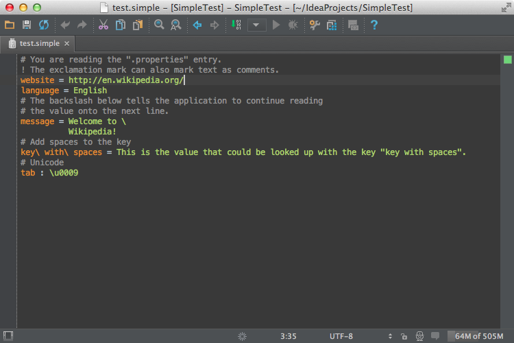
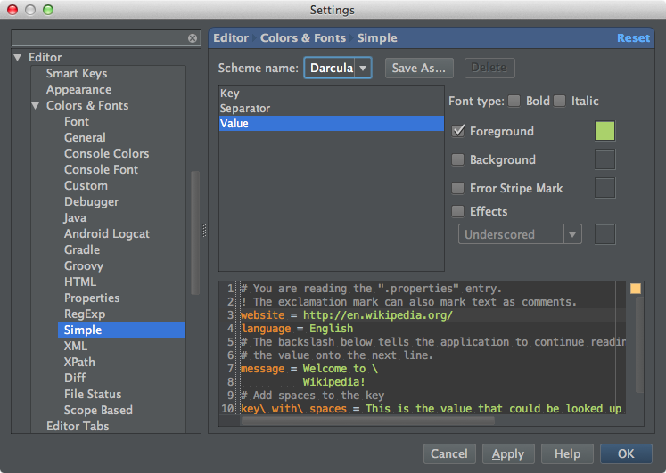

<!--
INITIAL_SOURCE https://confluence.jetbrains.com/display/IntelliJIDEA/Syntax+Highlighter+and+Color+Settings+Page
-->


### 1. Define a syntax highlighter

```java
package com.simpleplugin;

import com.intellij.lexer.FlexAdapter;
import com.intellij.lexer.Lexer;
import com.intellij.openapi.editor.SyntaxHighlighterColors;
import com.intellij.openapi.editor.colors.TextAttributesKey;
import com.intellij.openapi.editor.markup.TextAttributes;
import com.intellij.openapi.fileTypes.SyntaxHighlighterBase;
import com.intellij.psi.TokenType;
import com.intellij.psi.tree.IElementType;
import com.simpleplugin.psi.SimpleTypes;
import org.jetbrains.annotations.NotNull;

import java.awt.*;
import java.io.Reader;

import static com.intellij.openapi.editor.colors.TextAttributesKey.createTextAttributesKey;

public class SimpleSyntaxHighlighter extends SyntaxHighlighterBase {
    public static final TextAttributesKey SEPARATOR = createTextAttributesKey("SIMPLE_SEPARATOR", SyntaxHighlighterColors.OPERATION_SIGN);
    public static final TextAttributesKey KEY = createTextAttributesKey("SIMPLE_KEY", SyntaxHighlighterColors.KEYWORD);
    public static final TextAttributesKey VALUE = createTextAttributesKey("SIMPLE_VALUE", SyntaxHighlighterColors.STRING);
    public static final TextAttributesKey COMMENT = createTextAttributesKey("SIMPLE_COMMENT", SyntaxHighlighterColors.LINE_COMMENT);

    static final TextAttributesKey BAD_CHARACTER = createTextAttributesKey("SIMPLE_BAD_CHARACTER",
            new TextAttributes(Color.RED, null, null, null, Font.BOLD));

    private static final TextAttributesKey[] BAD_CHAR_KEYS = new TextAttributesKey[]{BAD_CHARACTER};
    private static final TextAttributesKey[] SEPARATOR_KEYS = new TextAttributesKey[]{SEPARATOR};
    private static final TextAttributesKey[] KEY_KEYS = new TextAttributesKey[]{KEY};
    private static final TextAttributesKey[] VALUE_KEYS = new TextAttributesKey[]{VALUE};
    private static final TextAttributesKey[] COMMENT_KEYS = new TextAttributesKey[]{COMMENT};
    private static final TextAttributesKey[] EMPTY_KEYS = new TextAttributesKey[0];

    @NotNull
    @Override
    public Lexer getHighlightingLexer() {
        return new FlexAdapter(new SimpleLexer((Reader) null));
    }

    @NotNull
    @Override
    public TextAttributesKey[] getTokenHighlights(IElementType tokenType) {
        if (tokenType.equals(SimpleTypes.SEPARATOR)) {
            return SEPARATOR_KEYS;
        } else if (tokenType.equals(SimpleTypes.KEY)) {
            return KEY_KEYS;
        } else if (tokenType.equals(SimpleTypes.VALUE)) {
            return VALUE_KEYS;
        } else if (tokenType.equals(SimpleTypes.COMMENT)) {
            return COMMENT_KEYS;
        } else if (tokenType.equals(TokenType.BAD_CHARACTER)) {
            return BAD_CHAR_KEYS;
        } else {
            return EMPTY_KEYS;
        }
    }
}
```

### 2. Define a syntax highlighter factory

```java
package com.simpleplugin;

import com.intellij.openapi.fileTypes.SyntaxHighlighter;
import com.intellij.openapi.fileTypes.SyntaxHighlighterFactory;
import com.intellij.openapi.project.Project;
import com.intellij.openapi.vfs.VirtualFile;
import org.jetbrains.annotations.NotNull;

public class SimpleSyntaxHighlighterFactory extends SyntaxHighlighterFactory {
    @NotNull
    @Override
    public SyntaxHighlighter getSyntaxHighlighter(Project project, VirtualFile virtualFile) {
        return new SimpleSyntaxHighlighter();
    }
}
```

### 3. Register the syntax highlighter factory

```xml
<lang.syntaxHighlighterFactory key="Simple" implementationClass="com.simpleplugin.SimpleSyntaxHighlighterFactory"/>
```

### 4. Run the project



### 5. Define a color settings page

```java
package com.simpleplugin;

import com.intellij.openapi.editor.colors.TextAttributesKey;
import com.intellij.openapi.fileTypes.SyntaxHighlighter;
import com.intellij.openapi.options.colors.AttributesDescriptor;
import com.intellij.openapi.options.colors.ColorDescriptor;
import com.intellij.openapi.options.colors.ColorSettingsPage;
import org.jetbrains.annotations.NotNull;
import org.jetbrains.annotations.Nullable;

import javax.swing.*;
import java.util.Map;

public class SimpleColorSettingsPage implements ColorSettingsPage {
    private static final AttributesDescriptor[] DESCRIPTORS = new AttributesDescriptor[]{
            new AttributesDescriptor("Key", SimpleSyntaxHighlighter.KEY),
            new AttributesDescriptor("Separator", SimpleSyntaxHighlighter.SEPARATOR),
            new AttributesDescriptor("Value", SimpleSyntaxHighlighter.VALUE),
    };

    @Nullable
    @Override
    public Icon getIcon() {
        return SimpleIcons.FILE;
    }

    @NotNull
    @Override
    public SyntaxHighlighter getHighlighter() {
        return new SimpleSyntaxHighlighter();
    }

    @NotNull
    @Override
    public String getDemoText() {
        return "# You are reading the \".properties\" entry.\n" +
                "! The exclamation mark can also mark text as comments.\n" +
                "website = http://en.wikipedia.org/\n" +
                "language = English\n" +
                "# The backslash below tells the application to continue reading\n" +
                "# the value onto the next line.\n" +
                "message = Welcome to \\\n" +
                "          Wikipedia!\n" +
                "# Add spaces to the key\n" +
                "key\\ with\\ spaces = This is the value that could be looked up with the key \"key with spaces\".\n" +
                "# Unicode\n" +
                "tab : \\u0009";
    }

    @Nullable
    @Override
    public Map<String, TextAttributesKey> getAdditionalHighlightingTagToDescriptorMap() {
        return null;
    }

    @NotNull
    @Override
    public AttributesDescriptor[] getAttributeDescriptors() {
        return DESCRIPTORS;
    }

    @NotNull
    @Override
    public ColorDescriptor[] getColorDescriptors() {
        return ColorDescriptor.EMPTY_ARRAY;
    }

    @NotNull
    @Override
    public String getDisplayName() {
        return "Simple";
    }
}
```

### 6. Register the color settings page

```xml
<colorSettingsPage implementation="com.simpleplugin.SimpleColorSettingsPage"/>
```

### 7. Run the project



-----------

[Previous](lexer_and_parser_definition.html)
[Top](cls_tutorial.html)
[Next](psi_helper_and_utilities.html)


