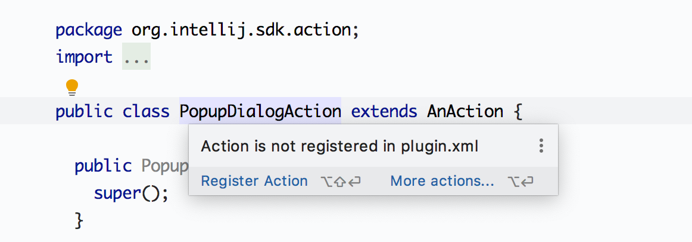
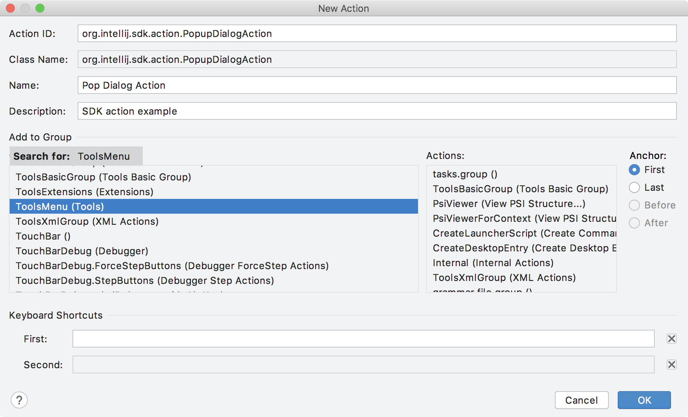

An action is technically a class, derived from the
[AnAction](upsource:///platform/editor-ui-api/src/com/intellij/openapi/actionSystem/AnAction.java)
class.
To update the state of the action, the method `AnAction.update()` is periodically called by IDEA.
The object of type
[AnActionEvent](upsource:///platform/editor-ui-api/src/com/intellij/openapi/actionSystem/AnActionEvent.java)
passed to this method carries the information about the current context for the action,
and in particular, the specific presentation which needs to be updated.


### 1.1. Creating actions

To create a new action we need to extend
[AnAction](upsource:///platform/editor-ui-api/src/com/intellij/openapi/actionSystem/AnAction.java)
class:

```java
public class SimpleAction extends AnAction {
}
```

### 1.2. Overriding actionPerformed()

The only method of an inheritor of
[AnAction](upsource:///platform/editor-ui-api/src/com/intellij/openapi/actionSystem/AnAction.java)
which is required to be overridden is `public void actionPerformed(AnActionEvent anActionEvent);`, and it should contain the code to be executed when the action has been invoked.
In this case the action does nothing.

```java
public class SimpleAction extends AnAction {
    @Override
    public void actionPerformed(AnActionEvent anActionEvent) {
    }
}
```

### 1.3. Registering actions

To register a newly created action, `<action>` attribute should be added to the `<actions>` section of the plugin configuration file
[plugin.xml](https://github.com/JetBrains/intellij-sdk-docs/blob/master/code_samples/register_actions/resources/META-INF/plugin.xml).
IntelliJ IDEA has an embedded inspection that spots unregistered actions.



To register the action and set up its attributes press ***Alt + Enter*** while the caret is placed on the action's declaration.

Fill the **New Action** form to set up action's parameters such as: action's name and description, a UI component the action is bound to,
visual position of the menu item the action is bound to, and a shortcut for invoking the action.
In our case the action will be available in the **Tools Menu**, it will be placed on top, and will have no shortcuts.



After filling the **New Action** form and applying the changes `<actions>` section of our
[plugin.xml](https://github.com/JetBrains/intellij-sdk-docs/blob/master/code_samples/register_actions/resources/META-INF/plugin.xml)
file will look like this:

```xml
<actions>
  <!-- Add your actions here -->
    <action id="org.jetbrains.tutorials.actions.SimpleAction" class="org.jetbrains.tutorials.actions.SimpleAction"
            text="Simple Action" description="IntelliJ Action System Demo">
        <add-to-group group-id="ToolsMenu" anchor="first"/>
    </action>
</actions>
```

### 1.4. Setting attributes manually

You can configure additional attributes of the action by editing its registration in the plugin.xml file.
Please refer to the [Action System documentation](/basics/action_system.html#registering-actions) for the full list
of supported attributes.

After performing the steps described above we need to compile and run the plugin to the the newly created action available as a Tools Menu item:


### 1.5. Performing an action

In order to make the action do something we need to implement `public void actionPerformed(AnActionEvent anActionEvent);` method.
In the following example action invokes a dialog that shows information about a selected Project View Item and has no icon and any pre-selected default option:

```java
@Override
public void actionPerformed(AnActionEvent anActionEvent) {
    Project project = anActionEvent.getProject();
    Navigatable navigatable = anActionEvent.getData(CommonDataKeys.NAVIGATABLE);
    if (project != null && navigatable != null) {
        Messages.showMessageDialog(project, navigatable.toString(), "Selected Element", Messages.getInformationIcon());
    }
}
```


### 1.6. Setting up action's visibility and availability

To manipulate with action's visibility and availability we need to override `public void update(@NotNull AnActionEvent e);`

Default implementation of this method does nothing.
Override this method to provide the ability to dynamically change action's state and(or) presentation depending on the context.

```java
public class SimpleAction extends AnAction {
    @Override
    public void actionPerformed(AnActionEvent anActionEvent) {
    //...
    }

    @Override
    public void update(AnActionEvent anActionEvent) {
    }
}
```

The following code sample illustrates how to make the action visible and available only when the following conditions are met:
there's a project available and there's an item you can navigate to selected in the project view pane:

```java
public class SimpleAction extends AnAction {
    @Override
    public void actionPerformed(AnActionEvent anActionEvent) {
    //...
    }

    @Override
    public void update(AnActionEvent anActionEvent) {
        Project project = anActionEvent.getProject();
        Navigatable navigatable = anActionEvent.getData(CommonDataKeys.NAVIGATABLE);
        anActionEvent.getPresentation().setEnabledAndVisible(project != null && navigatable != null);
    }
}
```

Parameter `anActionEvent` carries information on the invocation place and data available.

**Note** This method can be called frequently: for instance, if an action is added to a toolbar, it will be updated twice a second.
This means that this method is supposed to work really fast, no real work should be done at this phase.
For example, checking selection in a tree or a list, is considered valid but working with the file system is not.
If you cannot understand the state of the action fast you should do it in the
[AnActionEvent](upsource:///platform/editor-ui-api/src/com/intellij/openapi/actionSystem/AnActionEvent.java)
method and notify the user that the action cannot be executed if it's the case.


After compiling and running the plugin project and invoking the action, the dialog will pop up:


