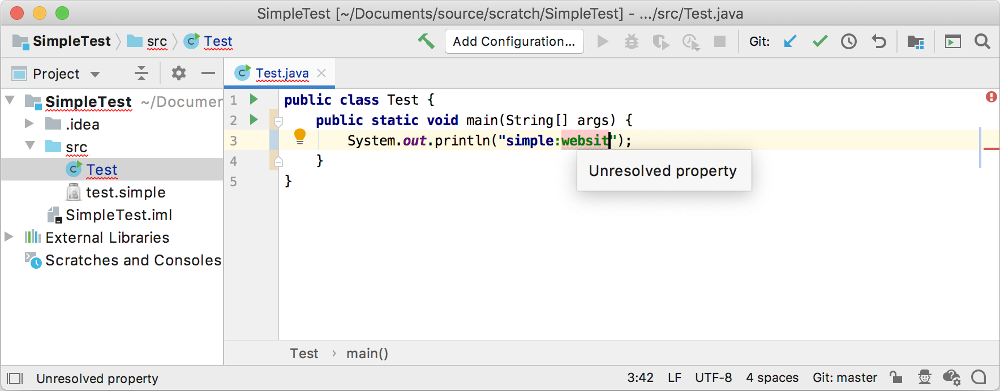

Annotator helps highlight and annotate any code based on specific rules.

### 7.1. Define an annotator

In this tutorial we will annotate usages of our properties within Java code.
Let's consider a literal which starts with *"simple:"* as a usage of our property.

```java
package com.simpleplugin;

import com.intellij.lang.annotation.Annotation;
import com.intellij.lang.annotation.AnnotationHolder;
import com.intellij.lang.annotation.Annotator;
import com.intellij.openapi.editor.DefaultLanguageHighlighterColors;
import com.intellij.openapi.project.Project;
import com.intellij.openapi.util.TextRange;
import com.intellij.psi.PsiElement;
import com.intellij.psi.PsiLiteralExpression;
import com.simpleplugin.psi.SimpleProperty;
import org.jetbrains.annotations.NotNull;

import java.util.List;

public class SimpleAnnotator implements Annotator {
    @Override
    public void annotate(@NotNull final PsiElement element, @NotNull AnnotationHolder holder) {
        if (element instanceof PsiLiteralExpression) {
            PsiLiteralExpression literalExpression = (PsiLiteralExpression) element;
            String value = (String) literalExpression.getValue();
            if (value != null && value.startsWith("simple:")) {
                Project project = element.getProject();
                String key = value.substring(7);
                List<SimpleProperty> properties = SimpleUtil.findProperties(project, key);
                if (properties.size() == 1) {
                    TextRange range = new TextRange(element.getTextRange().getStartOffset() + 7,
                            element.getTextRange().getStartOffset() + 7);
                    Annotation annotation = holder.createInfoAnnotation(range, null);
                    annotation.setTextAttributes(DefaultLanguageHighlighterColors.LINE_COMMENT);
                } else if (properties.size() == 0) {
                    TextRange range = new TextRange(element.getTextRange().getStartOffset() + 8,
                            element.getTextRange().getEndOffset());
                    holder.createErrorAnnotation(range, "Unresolved property");
                }
            }
        }
    }
}
```

### 7.2. Register the annotator

```xml
<annotator language="JAVA" implementationClass="com.simpleplugin.SimpleAnnotator"/>
```

### 7.3. Run the project

Let's define the following Java file and check if the IDE resolves a property.

```java
public class Test {
    public static void main(String[] args) {
        System.out.println("simple:website");
    }
}
```


If we type an undefined property name, it will annotate the code with a error.



[Previous](psi_helper_and_utilities.md)
[Top](/tutorials/custom_language_support_tutorial.md)
[Next](line_marker_provider.md)

