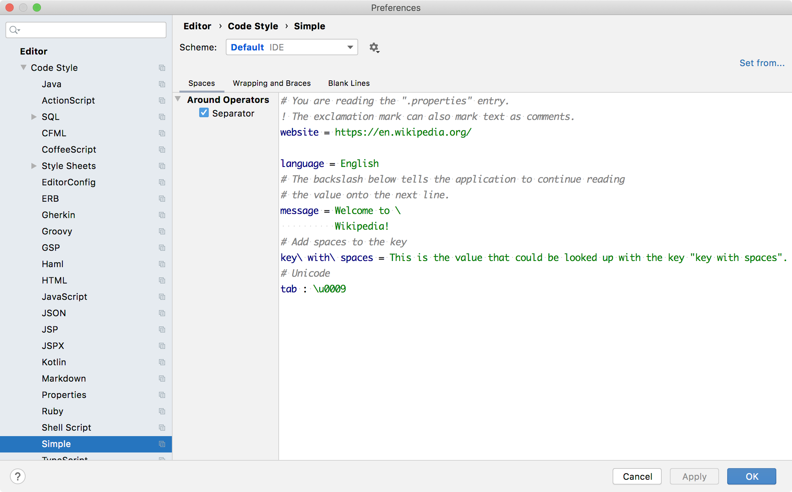

### 16.1. Define code style settings

```java
package com.simpleplugin;

import com.intellij.psi.codeStyle.CodeStyleSettings;
import com.intellij.psi.codeStyle.CustomCodeStyleSettings;

public class SimpleCodeStyleSettings extends CustomCodeStyleSettings {
    public SimpleCodeStyleSettings(CodeStyleSettings settings) {
        super("SimpleCodeStyleSettings", settings);
    }
}
```

### 16.2. Define code style settings provider

```java
package com.simpleplugin;

import com.intellij.application.options.CodeStyleAbstractConfigurable;
import com.intellij.application.options.CodeStyleAbstractPanel;
import com.intellij.application.options.TabbedLanguageCodeStylePanel;
import com.intellij.openapi.options.Configurable;
import com.intellij.psi.codeStyle.CodeStyleSettings;
import com.intellij.psi.codeStyle.CodeStyleSettingsProvider;
import com.intellij.psi.codeStyle.CustomCodeStyleSettings;
import org.jetbrains.annotations.NotNull;
import org.jetbrains.annotations.Nullable;

public class SimpleCodeStyleSettingsProvider extends CodeStyleSettingsProvider {
    @Override
    public CustomCodeStyleSettings createCustomSettings(CodeStyleSettings settings) {
        return new SimpleCodeStyleSettings(settings);
    }

    @Nullable
    @Override
    public String getConfigurableDisplayName() {
        return "Simple";
    }

    @NotNull
    @Override
    public Configurable createSettingsPage(CodeStyleSettings settings, CodeStyleSettings originalSettings) {
        return new CodeStyleAbstractConfigurable(settings, originalSettings, "Simple") {
            @Override
            protected CodeStyleAbstractPanel createPanel(CodeStyleSettings settings) {
                return new SimpleCodeStyleMainPanel(getCurrentSettings(), settings);
            }

            @Nullable
            @Override
            public String getHelpTopic() {
                return null;
            }
        };
    }

    private static class SimpleCodeStyleMainPanel extends TabbedLanguageCodeStylePanel {
        public SimpleCodeStyleMainPanel(CodeStyleSettings currentSettings, CodeStyleSettings settings) {
            super(SimpleLanguage.INSTANCE, currentSettings, settings);
        }
    }
}
```


### 16.3. Register the code style settings provider

```xml
<codeStyleSettingsProvider implementation="com.simpleplugin.SimpleCodeStyleSettingsProvider"/>
```

### 16.4. Define language code style settings provider

```java
package com.simpleplugin;

import com.intellij.lang.Language;
import com.intellij.psi.codeStyle.CodeStyleSettingsCustomizable;
import com.intellij.psi.codeStyle.LanguageCodeStyleSettingsProvider;
import org.jetbrains.annotations.NotNull;

public class SimpleLanguageCodeStyleSettingsProvider extends LanguageCodeStyleSettingsProvider {
    @NotNull
    @Override
    public Language getLanguage() {
        return SimpleLanguage.INSTANCE;
    }

    @Override
    public void customizeSettings(@NotNull CodeStyleSettingsCustomizable consumer, @NotNull SettingsType settingsType) {
        if (settingsType == SettingsType.SPACING_SETTINGS) {
            consumer.showStandardOptions("SPACE_AROUND_ASSIGNMENT_OPERATORS");
            consumer.renameStandardOption("SPACE_AROUND_ASSIGNMENT_OPERATORS", "Separator");
        } else if (settingsType == SettingsType.BLANK_LINES_SETTINGS) {
            consumer.showStandardOptions("KEEP_BLANK_LINES_IN_CODE");
        } else if (settingsType == SettingsType.WRAPPING_AND_BRACES_SETTINGS) {
            consumer.showStandardOptions("KEEP_LINE_BREAKS");
        }
    }

    @Override
    public String getCodeSample(@NotNull SettingsType settingsType) {
        return "# You are reading the \".properties\" entry.\n" +
                "! The exclamation mark can also mark text as comments.\n" +
                "website = http://en.wikipedia.org/\n" +
                "language = English\n" +
                "# The backslash below tells the application to continue reading\n" +
                "# the value onto the next line.\n" +
                "message = Welcome to \\\n" +
                "          Wikipedia!\n" +
                "# Add spaces to the key\n" +
                "key\\ with\\ spaces = This is the value that could be looked up with the key \"key with spaces\".\n" +
                "# Unicode\n" +
                "tab : \\u0009";
    }
}
```

### 16.5. Register the language code style settings provider

```xml
<langCodeStyleSettingsProvider implementation="com.simpleplugin.SimpleLanguageCodeStyleSettingsProvider"/>
```

### 16.6. Run the project



[Previous](formatter.html)
[Top](../custom_language_support_tutorial.html)
[Next](commenter.html)
