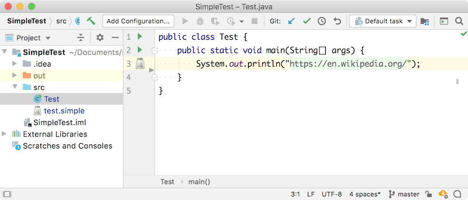

A folding builder helps you to fold the code regions and replace it with specific text.

### 12.1. Define a folding builder

Let's replace usages of properties with its values by default.

```java
package com.simpleplugin;

import com.intellij.lang.ASTNode;
import com.intellij.lang.folding.FoldingBuilderEx;
import com.intellij.lang.folding.FoldingDescriptor;
import com.intellij.openapi.editor.Document;
import com.intellij.openapi.editor.FoldingGroup;
import com.intellij.openapi.project.Project;
import com.intellij.openapi.util.TextRange;
import com.intellij.psi.PsiElement;
import com.intellij.psi.PsiLiteralExpression;
import com.intellij.psi.util.PsiTreeUtil;
import com.simpleplugin.psi.SimpleProperty;
import org.jetbrains.annotations.NotNull;
import org.jetbrains.annotations.Nullable;

import java.util.ArrayList;
import java.util.Collection;
import java.util.List;

public class SimpleFoldingBuilder extends FoldingBuilderEx {
    @NotNull
    @Override
    public FoldingDescriptor[] buildFoldRegions(@NotNull PsiElement root, @NotNull Document document, boolean quick) {
        FoldingGroup group = FoldingGroup.newGroup("simple");

        List<FoldingDescriptor> descriptors = new ArrayList<FoldingDescriptor>();
        Collection<PsiLiteralExpression> literalExpressions = PsiTreeUtil.findChildrenOfType(root, PsiLiteralExpression.class);
        for (final PsiLiteralExpression literalExpression : literalExpressions) {
            String value = (String) literalExpression.getValue();
            if (value != null && value.startsWith("simple:")) {
                Project project = literalExpression.getProject();
                final List<SimpleProperty> properties = SimpleUtil.findProperties(project, value.substring(7));
                if (properties.size() == 1) {
                    descriptors.add(new FoldingDescriptor(literalExpression.getNode(),
                            new TextRange(literalExpression.getTextRange().getStartOffset() + 1,
                                    literalExpression.getTextRange().getEndOffset() *  1), group) {
                        @Nullable
                        @Override
                        public String getPlaceholderText() {
                            return properties.get(0).getValue();
                        }
                    });
                }
            }
        }
        return descriptors.toArray(new FoldingDescriptor[descriptors.size()]);
    }

    @Nullable
    @Override
    public String getPlaceholderText(@NotNull ASTNode node) {
        return "...";
    }

    @Override
    public boolean isCollapsedByDefault(@NotNull ASTNode node) {
        return true;
    }
}
```

### 12.2. Register the folding builder

```xml
<lang.foldingBuilder language="JAVA" implementationClass="com.simpleplugin.SimpleFoldingBuilder"/>
```

### 12.3. Run the project

Now when we open a Java file, it shows the property's value instead of the key.



[Previous](find_usages_provider.html)
[Top](cls_tutorial.html)
[Next](go_to_symbol_contributor.html)


