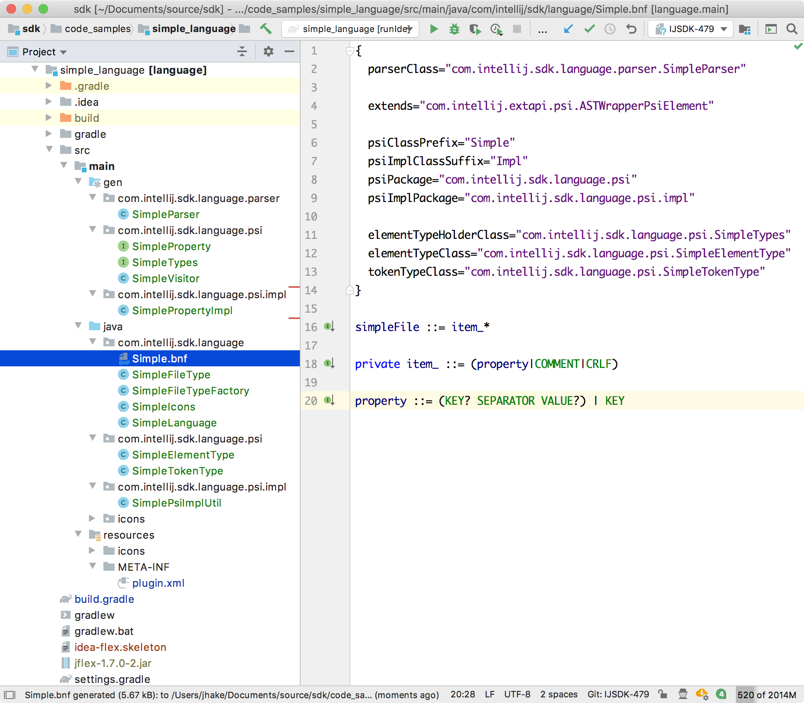

### 3.1. Define a token type

```java

```

### 3.2. Define an element type

```java

```

### 3.3. Define grammar

Define a grammar for the properties language with */com/simpleplugin/Simple.bnf* file.

```java

```

As you see a properties file can contain properties, comments and line breaks.

The grammar defines how flexible the support for a language can be.
We specified that a property may have or may not have key and value.
This lets the IDE still recognise incorrectly defined properties and provide corresponding code analysis and quick-fixes.

### 3.4. Generate a parser

Now when the grammar is defined we can generate a parser with PSI classes via *Generate Parser Code* from the context menu or via *⌘⇧G* shortcut on *Simple.bnf* file.
The Grammar-Kit will generate a parser and PSI elements in *gen* folder.
Mark this folder as a source root and make sure everything is compiled without errors.



-------
[Previous](language_and_filetype.md)
[Top](/tutorials/custom_language_support_tutorial.md)
[Next](lexer_and_parser_definition.md)


