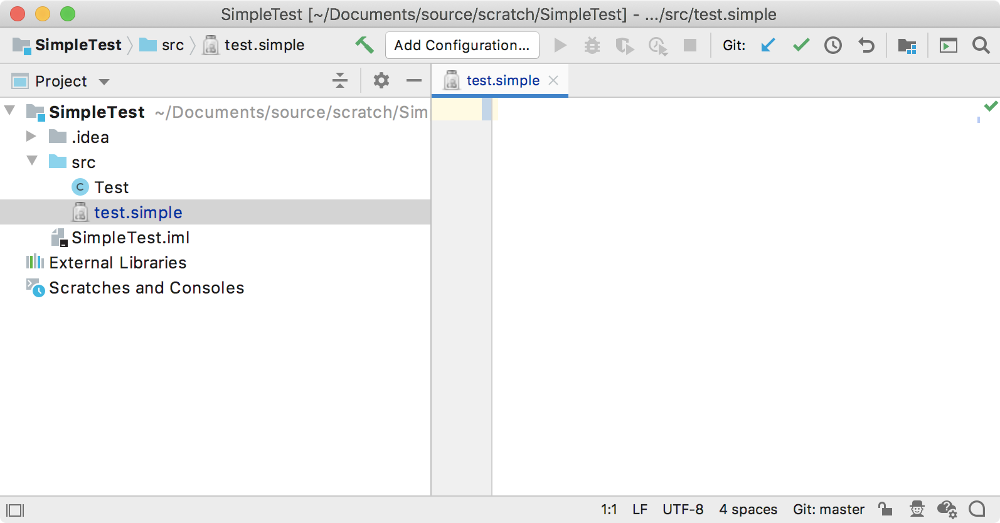

The IntelliJ Platform [determines file type](/reference_guide/custom_language_support/registering_file_type.md) by examining the name of a file.
Each language has [Language](upsource:///platform/core-api/src/com/intellij/lang/Language.java) and [LanguageFileType](upsource:///platform/core-api/src/com/intellij/openapi/fileTypes/LanguageFileType.java) objects defining the language.
The `LanguageFileType` is registered with the IntelliJ Platform in the plugin configuration file. 

* bullet item
{:toc}

## 2.1. Define the Language
The language implemented in this tutorial is named "Simple" - note the case of the name.
The `SimpleLanguage` class is defined in the `com.intellij.sdk.language` package of the `simple_language` code sample:
```java

```

## 2.2. Define an Icon
The [icon](https://raw.githubusercontent.com/JetBrains/intellij-sdk-docs/master/code_samples/simple_language_plugin/src/com/simpleplugin/icons/jar-gray.png) for the Simple language is defined by the `SimpleIcons` class. 
There is nothing uniquely Simple language-specific about [defining the icon](/reference_guide/work_with_icons_and_images.md) itself.
The definition follows a pattern similar to defining, e.g., `SdkIcons`. 
```java

```

## 2.3. Define a FileType
The Simple language file type is defined by subclassing `LanguageFileType`:
```java

```

## 2.4. Register the FileType Directly
Direct registration is necessary when targeting version 2019.2 (and later) of the IntelliJ Platform.
No `FileTypeFactory` is required.
Instead, the file type is registered of file type is done via the `com.intellij.fileType` extension point in `plugin.xml`: 
```xml
<extensions defaultExtensionNs="com.intellij">
    <fileType name="Simple file" implementationClass="com.intellij.sdk.language.SimpleFileType" fieldName="INSTANCE"
            language="Simple" extensions="simple"/>
</extensions>
```

Skip to [section 2.6](#26-run-the-project).

## 2.5. Register the FileType Using a Factory
This pattern is necessary when targeting versions of the IntelliJ Platform prior to 2019.2

### 2.5.1 Define a FileType Factory
First, define `SimpleFileTypeFactory` as a subclass of `FileTypeFactory`.
```java

```

### 2.5.2 Register the FileType Factory
The `FileTypeFactory` is registered with the IntelliJ Platform using the `com.intellij.openapi.fileTypes.FileTypeFactory` extension point in `plugin.xml`.
```xml
<extensions defaultExtensionNs="com.intellij">
    <fileTypeFactory implementation="com.intellij.sdk.language.SimpleFileTypeFactory"/>
</extensions>
```

## 2.6. Run the Project
Create an empty file with the extension `\*.simple` and IntelliJ IDEA will automatically associate it with our language.
Note the appearance of the Simple language file icon next to the `test.simple` file in the **Project Tool Window** and in the editor tab for the file.

{:width="800px"}
