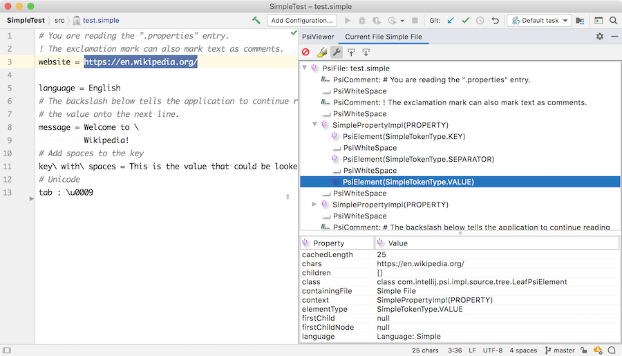

<!-- Copyright 2000-2020 JetBrains s.r.o. and other contributors. Use of this source code is governed by the Apache 2.0 license that can be found in the LICENSE file. -->

The lexical analyzer defines how the [contents of a file are broken into tokens](/reference_guide/custom_language_support/implementing_lexer.md), which is the basis for supporting custom language features.
The easiest way to create a lexer is to use [JFlex](https://jflex.de/).

* bullet item
{:toc}

## Required Project Configuration Change
The previous tutorial step [Grammar and Parser](grammar_and_parser.md), and this page, generate source files in the directory `src/main/gen`.
To include those files, the project's `sourceSets` must be expanded by inserting the following line in the project's `build.gradle` file:

```groovy
  sourceSets.main.java.srcDirs 'src/main/gen'
```

## 4.1. Define a Lexer
Define a `Simple.flex` file with rules for the Simple Language lexer, as demonstrated in `org.intellij.sdk.language.Simple.flex`.

```java

```

## 4.2. Generate a Lexer Class
Now generate a lexer class via **JFlex Generator** from the context menu on `Simple.flex` file.

The Grammar-Kit plugin uses the JFlex lexer generation.
When running for the first time, JFlex prompts for a destination folder to download the JFlex library and skeleton.
Choose the project root directory, for example `code_samples/simple_language_plugin`.

After that, the IDE generates the lexer under the `gen` directory, for example in `simple_language_plugin/src/main/gen/org/intellij/sdk/language/SimpleLexer`.

> **TIP** Gradle plugin [gradle-grammarkit-plugin](https://github.com/JetBrains/gradle-grammar-kit-plugin) can be used alternatively.

See [Implementing Lexer](/reference_guide/custom_language_support/implementing_lexer.md) for more information about using _JFlex_ with the IntelliJ Platform.

## 4.3. Define a Lexer Adapter
The JFlex lexer needs to be adapted to the IntelliJ Platform Lexer API.
This is done by subclassing [`FlexAdapter`](upsource:///platform/core-api/src/com/intellij/lexer/FlexAdapter.java). 

```java

```

## 4.4. Define a Root File
The `SimpleFile` implementation is the top-level node of the [tree of `PsiElements`](/reference_guide/custom_language_support/implementing_parser_and_psi.md) for a Simple Language file.

```java

```

## 4.5. Define a Parser
The Simple Language parser is defined by subclassing [`ParserDefinition`](upsource:///platform/core-api/src/com/intellij/lang/ParserDefinition.java). 

```java

```

## 4.6. Register the Parser Definition
Registering the parser definition in the `plugin.xml` file makes it available to the IntelliJ Platform.
Use the `com.intellij.lang.parserDefinition` extension point for registration.
For example, see `simple_language_plugin/src/main/resources/META-INF/plugin.xml`.

```xml
  <extensions defaultExtensionNs="com.intellij">
    <lang.parserDefinition language="Simple" 
            implementationClass="org.intellij.sdk.language.SimpleParserDefinition"/>
  </extensions>
```

## 4.7. Run the Project
With the `simple_language_plugin` loaded in a Development Instance, create a `test.simple` properties file with the following content: 

```text
# You are reading the ".properties" entry.
! The exclamation mark can also mark text as comments.
website = https://en.wikipedia.org/
language = English
# The backslash below tells the application to continue reading
# the value onto the next line.
message = Welcome to \
          Wikipedia!
# Add spaces to the key
key\ with\ spaces = This is the value that could be looked up with the key "key with spaces".
# Unicode
tab : \u0009
```

Now open the *PsiViewer* tool window and check how the lexer breaks the content of the file into tokens, and the parser parsed the tokens into PSI elements.

{:width="900px"}
