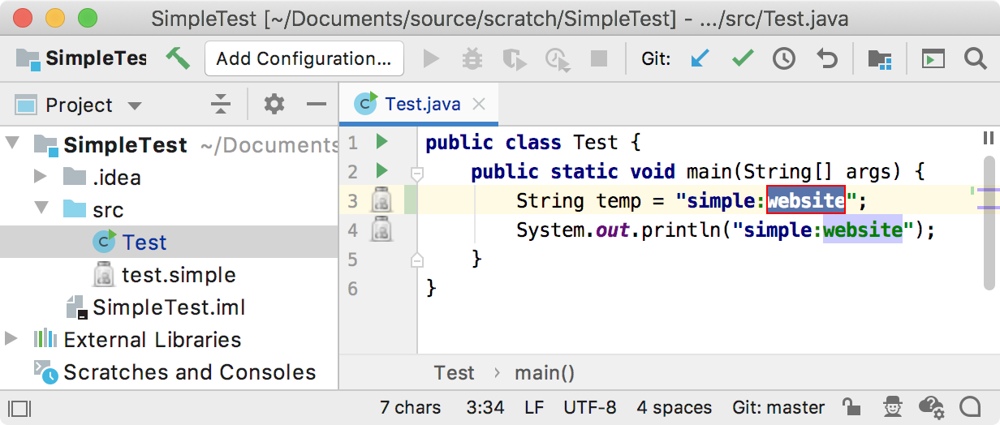

References is one of the most important and tricky parts in the implementation of a custom language support.
Resolving references means the ability to go from the usage of an element to the declaration of the element, completion, rename refactoring, find usages, etc.

**Every element which can be renamed or referenced needs to implement *com.intellij.psi.PsiNamedElement* interface.**

### 10.1. Define a base named element class

```java
package com.simpleplugin.psi;

import com.intellij.psi.PsiNameIdentifierOwner;

public interface SimpleNamedElement extends PsiNameIdentifierOwner {
}
```

```java
package com.simpleplugin.psi.impl;

import com.intellij.extapi.psi.ASTWrapperPsiElement;
import com.intellij.lang.ASTNode;
import com.simpleplugin.psi.SimpleNamedElement;
import org.jetbrains.annotations.NotNull;

public abstract class SimpleNamedElementImpl extends ASTWrapperPsiElement implements SimpleNamedElement {
    public SimpleNamedElementImpl(@NotNull ASTNode node) {
        super(node);
    }
}
```

### 10.2. Define helper methods for generated PSI elements

Since we need to implement new methods in PSI class, we should define them in our utility.

```java
public static String getName(SimpleProperty element) {
    return getKey(element);
}

public static PsiElement setName(SimpleProperty element, String newName) {
    ASTNode keyNode = element.getNode().findChildByType(SimpleTypes.KEY);
    if (keyNode != null) {

        SimpleProperty property = SimpleElementFactory.createProperty(element.getProject(), newName);
        ASTNode newKeyNode = property.getFirstChild().getNode();
        element.getNode().replaceChild(keyNode, newKeyNode);
    }
    return element;
}

public static PsiElement getNameIdentifier(SimpleProperty element) {
    ASTNode keyNode = element.getNode().findChildByType(SimpleTypes.KEY);
    if (keyNode != null) {
        return keyNode.getPsi();
    } else {
        return null;
    }
}
```

### 10.3. Define an element factory

```java
package com.simpleplugin.psi;

import com.intellij.openapi.project.Project;
import com.intellij.psi.PsiFileFactory;
import com.simpleplugin.SimpleFileType;

public class SimpleElementFactory {
    public static SimpleProperty createProperty(Project project, String name) {
        final SimpleFile file = createFile(project, name);
        return (SimpleProperty) file.getFirstChild();
    }

    public static SimpleFile createFile(Project project, String text) {
        String name = "dummy.simple";
        return (SimpleFile) PsiFileFactory.getInstance(project).
                createFileFromText(name, SimpleFileType.INSTANCE, text);
    }
}
```

### 10.4. Update grammar and regenerate the parser

Now we need to make corresponding changes to the grammar file and regenerate parser and PSI classes.

```java
property ::= (KEY? SEPARATOR VALUE?) | KEY {mixin="com.simpleplugin.psi.impl.SimpleNamedElementImpl"
  implements="com.simpleplugin.psi.SimpleNamedElement" methods=[getKey getValue getName setName getNameIdentifier]}
```

### 10.5. Define a reference

Now we need to define a reference class to resolve a property from it's usage.

```java
package com.simpleplugin;

import com.intellij.codeInsight.lookup.LookupElement;
import com.intellij.codeInsight.lookup.LookupElementBuilder;
import com.intellij.openapi.project.Project;
import com.intellij.openapi.util.TextRange;
import com.intellij.psi.*;
import com.simpleplugin.psi.SimpleProperty;
import org.jetbrains.annotations.NotNull;
import org.jetbrains.annotations.Nullable;

import java.util.ArrayList;
import java.util.List;

public class SimpleReference extends PsiReferenceBase<PsiElement> implements PsiPolyVariantReference {
    private String key;

    public SimpleReference(@NotNull PsiElement element, TextRange textRange) {
        super(element, textRange);
        key = element.getText().substring(textRange.getStartOffset(), textRange.getEndOffset());
    }

    @NotNull
    @Override
    public ResolveResult[] multiResolve(boolean incompleteCode) {
        Project project = myElement.getProject();
        final List<SimpleProperty> properties = SimpleUtil.findProperties(project, key);
        List<ResolveResult> results = new ArrayList<ResolveResult>();
        for (SimpleProperty property : properties) {
            results.add(new PsiElementResolveResult(property));
        }
        return results.toArray(new ResolveResult[results.size()]);
    }

    @Nullable
    @Override
    public PsiElement resolve() {
        ResolveResult[] resolveResults = multiResolve(false);
        return resolveResults.length == 1 ? resolveResults[0].getElement() : null;
    }

    @NotNull
    @Override
    public Object[] getVariants() {
        Project project = myElement.getProject();
        List<SimpleProperty> properties = SimpleUtil.findProperties(project);
        List<LookupElement> variants = new ArrayList<LookupElement>();
        for (final SimpleProperty property : properties) {
            if (property.getKey() != null && property.getKey().length() > 0) {
                variants.add(LookupElementBuilder.create(property).
                        withIcon(SimpleIcons.FILE).
                        withTypeText(property.getContainingFile().getName())
                );
            }
        }
        return variants.toArray();
    }
}
```

### 10.6. Define a reference contributor

A reference contributor allows you to provide references from elements in other languages such as Java to elements in your language.
Let's contribute a reference to each usage of a property.

```java
package com.simpleplugin;

import com.intellij.openapi.util.TextRange;
import com.intellij.patterns.PlatformPatterns;
import com.intellij.psi.*;
import com.intellij.util.ProcessingContext;
import org.jetbrains.annotations.NotNull;

public class SimpleReferenceContributor extends PsiReferenceContributor {
    @Override
    public void registerReferenceProviders(PsiReferenceRegistrar registrar) {
        registrar.registerReferenceProvider(PlatformPatterns.psiElement(PsiLiteralExpression.class),
                new PsiReferenceProvider() {
                    @NotNull
                    @Override
                    public PsiReference[] getReferencesByElement(@NotNull PsiElement element, @NotNull ProcessingContext context) {
                        PsiLiteralExpression literalExpression = (PsiLiteralExpression) element;
                        String text = (String) literalExpression.getValue();
                        if (text != null && text.startsWith("simple:")) {
                            return new PsiReference[]{new SimpleReference(element, new TextRange(8, text.length() + 1))};
                        }
                        return new PsiReference[0];
                    }
                });
    }
}
```

### 10.7. Register the reference contributor

```xml
<psi.referenceContributor implementation="com.simpleplugin.SimpleReferenceContributor"/>
```

### 10.8. Run the project

As you see the IDE now resolves the property and provides completion.


*Rename* refactoring available from definition and usages.


### 10.9. Define a refactoring support provider

To allow in-place refactoring we should specify it explicitly in a refactoring support provider.

```java
package com.simpleplugin;

import com.intellij.lang.refactoring.RefactoringSupportProvider;
import com.intellij.psi.PsiElement;
import com.simpleplugin.psi.SimpleProperty;

public class SimpleRefactoringSupportProvider extends RefactoringSupportProvider {
    @Override
    public boolean isMemberInplaceRenameAvailable(PsiElement element, PsiElement context) {
        return element instanceof SimpleProperty;
    }
}
```

### 10.10. Register the refactoring support provider

```xml
<lang.refactoringSupport language="Simple" implementationClass="com.simpleplugin.SimpleRefactoringSupportProvider"/>
```

### 10.11. Run the project



[Previous](completion_contributor.html)
[Top](../custom_language_support_tutorial.html)
[Next](find_usages_provider.html)


