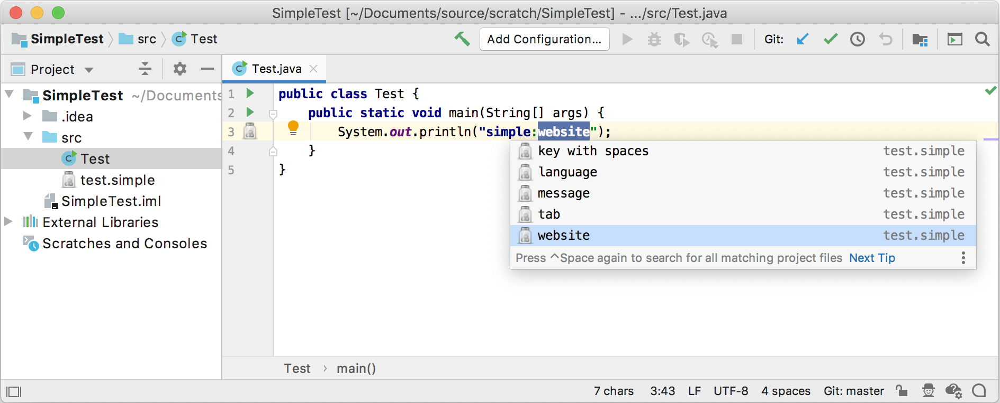
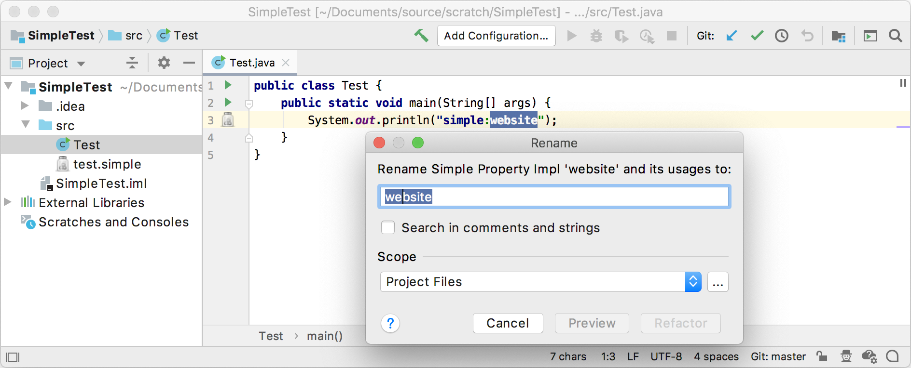

References is one of the most important and tricky parts in the implementation of a custom language support.
Resolving references means the ability to go from the usage of an element to the declaration of the element, completion, rename refactoring, find usages, etc.

**Every element which can be renamed or referenced needs to implement *com.intellij.psi.PsiNamedElement* interface.**

### 10.1. Define a base named element class

```java

```

```java

```

### 10.2. Define helper methods for generated PSI elements

Since we need to implement new methods in PSI class, we should define them in our utility.

```java
public static String getName(SimpleProperty element) {
    return getKey(element);
}

public static PsiElement setName(SimpleProperty element, String newName) {
    ASTNode keyNode = element.getNode().findChildByType(SimpleTypes.KEY);
    if (keyNode != null) {

        SimpleProperty property = SimpleElementFactory.createProperty(element.getProject(), newName);
        ASTNode newKeyNode = property.getFirstChild().getNode();
        element.getNode().replaceChild(keyNode, newKeyNode);
    }
    return element;
}

public static PsiElement getNameIdentifier(SimpleProperty element) {
    ASTNode keyNode = element.getNode().findChildByType(SimpleTypes.KEY);
    if (keyNode != null) {
        return keyNode.getPsi();
    } else {
        return null;
    }
}
```

### 10.3. Define an element factory

```java
package com.simpleplugin.psi;

import com.intellij.openapi.project.Project;
import com.intellij.psi.PsiFileFactory;
import com.simpleplugin.SimpleFileType;

public class SimpleElementFactory {
    public static SimpleProperty createProperty(Project project, String name) {
        final SimpleFile file = createFile(project, name);
        return (SimpleProperty) file.getFirstChild();
    }

    public static SimpleFile createFile(Project project, String text) {
        String name = "dummy.simple";
        return (SimpleFile) PsiFileFactory.getInstance(project).
                createFileFromText(name, SimpleFileType.INSTANCE, text);
    }
}
```

### 10.4. Update grammar and regenerate the parser

Now we need to make corresponding changes to the grammar file and regenerate parser and PSI classes.

```java
property ::= (KEY? SEPARATOR VALUE?) | KEY {mixin="com.simpleplugin.psi.impl.SimpleNamedElementImpl"
  implements="com.simpleplugin.psi.SimpleNamedElement" methods=[getKey getValue getName setName getNameIdentifier]}
```

### 10.5. Define a reference

Now we need to define a reference class to resolve a property from it's usage.

```java

```

### 10.6. Define a reference contributor

A reference contributor allows you to provide references from elements in other languages such as Java to elements in your language.
Let's contribute a reference to each usage of a property.

```java

```

### 10.7. Register the reference contributor

```xml
<psi.referenceContributor implementation="com.simpleplugin.SimpleReferenceContributor"/>
```

### 10.8. Run the project

As you see the IDE now resolves the property and provides completion.



*Rename* refactoring available from definition and usages.



### 10.9. Define a refactoring support provider

To allow in-place refactoring we should specify it explicitly in a refactoring support provider.

```java

```

### 10.10. Register the refactoring support provider

```xml
<lang.refactoringSupport language="Simple" implementationClass="com.simpleplugin.SimpleRefactoringSupportProvider"/>
```

### 10.11. Run the project


[Previous](completion_contributor.md)
[Top](/tutorials/custom_language_support_tutorial.md)
[Next](find_usages_provider.md)


