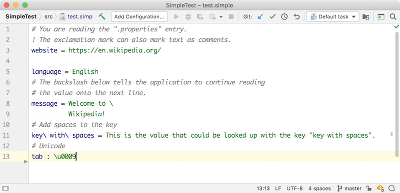
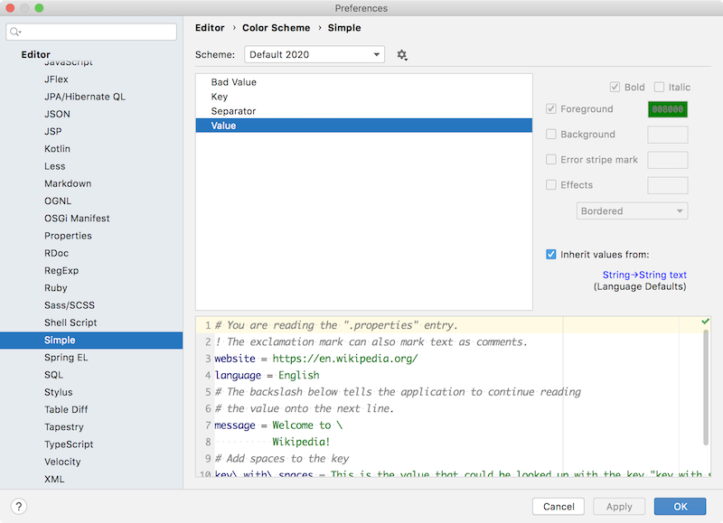

The first level of [syntax highlighting](/reference_guide/custom_language_support/syntax_highlighting_and_error_highlighting.md#lexer) is based on the lexer output, and is provided by `SyntaxHighlighter`.
A plugin can also define [color settings](/reference_guide/custom_language_support/syntax_highlighting_and_error_highlighting.md#color-settings) based on `ColorSettingPage` so the user can configure highlight colors.
The `SimpleSyntaxHighlighter`, `SimpleSyntaxHighlighterFactory`, and `SimpleColorSettingsPage` discussed on this page are demonstrated in the `simple_language` code sample.

* bullet list
{:toc}

## 5.1. Define a Syntax Highlighter 
The Simple language syntax highlighter class extends [`SyntaxHighlighterBase`](upsource:///platform/editor-ui-api/src/com/intellij/openapi/fileTypes/SyntaxHighlighterBase.java).
As recommended in [Color Scheme Management](/reference_guide/color_scheme_management.md#text-attribute-key-dependency), the Simple language highlighting text attributes are specified as a dependency on one of standard Intellij Platform keys. 
For the Simple language, only one scheme is defined.
```java

```

### 5.2. Define a Syntax Highlighter Factory
The factory provides a standard way for the IntelliJ Platform to instantiate the syntax highlighter for Simple language files.
```java

```

### 5.3. Register the Syntax Highlighter Factory
The factory is registered with the IntelliJ Platform using the plugin configuration file.
```xml
  <extensions defaultExtensionNs="com.intellij">
    <lang.syntaxHighlighterFactory language="Simple" implementationClass="com.intellij.sdk.language.SimpleSyntaxHighlighterFactory"/>
  </extensions>
```

### 5.4. Run the Project
Open the example Simple Language [properties file ](/tutorials/custom_language_support/lexer_and_parser_definition.md#47-run-the-project) in the IDE Development Instance.
The colors for Simple Language Key, Separator, and Value highlighting default to the IDE _Language Defaults_ for Keyword, Braces and Operators, and String, respectively.

{:width="800px"}

## 5.5. Define a Color Settings Page
The color settings page adds the ability for users to customize color settings for the highlighting in Simple language files. 
The `SimpleColorSettingsPage` extends `ColorSettingsPage`. 
```java

```

### 5.6. Register the Color Settings Page
The settings page for Simple language colors is registered in the plugin configuration file as an extension. 
```xml
  <extensions defaultExtensionNs="com.intellij">
    <colorSettingsPage implementation="com.intellij.sdk.language.SimpleColorSettingsPage"/>
  </extensions>
```

### 5.7. Run the project
In the IDE Development Instance, open the Simple language highlight settings page: **Preferences/Settings \| Editor \| Color Scheme \| Simple**.
Each color initially inherits from a _Language Defaults_ value.

{:width="800px"}
