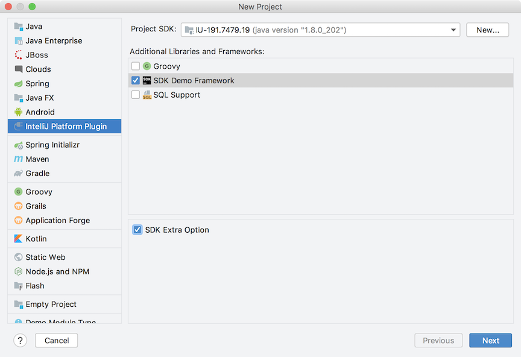

The following tutorial meant to show how to support a custom framework type for a project and make this framework type embedded in a project wizard as a UI component.

## 1. Creating a new framework

In oder to make a custom framework available and configurable for a project
[FrameworkTypeEx](https://github.com/JetBrains/intellij-community/blob/master/java/idea-ui/src/com/intellij/framework/FrameworkTypeEx.java)
class needs to be extended:


```java
public class DemoFramework extends FrameworkTypeEx {
}
```

## 2. Registering framework

The newly created framework should be registered as an extension point by putting *framework.type* attribute into *\<extensions\>* section of
[plugin.xml](https://github.com/JetBrains/intellij-sdk/blob/master/code_samples/framework/META-INF/plugin.xml)
configuration file:


```xml
<extensions defaultExtensionNs="com.intellij">
    <framework.type implementation="com.intellij.tutorials.framework.DemoFramework"/>
</extensions>
```

## 3. Setting up mandatory attributes

The framework component should have a unique name passed as a string literal to the constructor:


```java
public class DemoFramework extends FrameworkTypeEx {
    public static final String FRAMEWORK_ID = "Demo";
    protected DemoFramework() {
        super(FRAMEWORK_ID);
    }
}
```

*Presentable name* and *icon* define the appearance of visual components related to the framework:


```java
public class DemoFramework extends FrameworkTypeEx {
    public static final String FRAMEWORK_ID = "Demo";
    protected DemoFramework() {
        super(FRAMEWORK_ID);
    }

    @NotNull
    @Override
    public String getPresentableName() {
        return "Demo Framework";
    }

    @NotNull
    @Override
    public Icon getIcon() {
        return AllIcons.Providers.Apache;
    }
}
```

## 4. Creating provider for enabling framework support

To make framework set up available while executing project creating steps 
```public FrameworkSupportInModuleProvider createProvider();```
of the
[DemoFramework](https://github.com/JetBrains/intellij-sdk/blob/master/code_samples/framework/src/com/intellij/tutorials/framework/DemoFramework.java)
must be implemented:


```java
@NotNull
@Override
public FrameworkSupportInModuleProvider createProvider() {
    return  new FrameworkSupportInModuleProvider() {
        @NotNull
        @Override
        public FrameworkTypeEx getFrameworkType() {
            return DemoFramework.this;
        }

        @NotNull
        @Override
        public FrameworkSupportInModuleConfigurable createConfigurable(@NotNull FrameworkSupportModel model) {
            return new FrameworkSupportInModuleConfigurable() {
                @Nullable
                @Override
                public JComponent createComponent() {
                    return new JCheckBox("Extra Option");
                }

                @Override
                public void addSupport(@NotNull Module module, @NotNull ModifiableRootModel model, @NotNull ModifiableModelsProvider provider) {
                    //do what you want here: setup a library, generate a specific file, etc
                }
            };
        }

        @Override
        public boolean isEnabledForModuleType(@NotNull ModuleType type) {
            return true;
        }
    };
}
```

After compiling and running the code sample above an extra option for configuring the newly created custom framework should be available in the Project Wizard:


----------

[Source code](https://github.com/JetBrains/intellij-sdk/tree/master/code_samples/framework/src/com/intellij/tutorials/framework)


